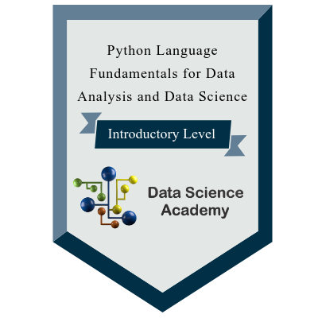
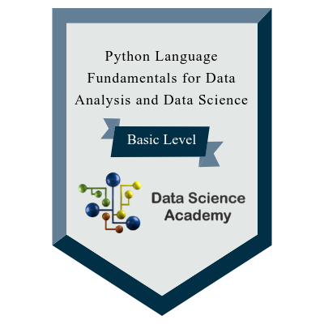

<>
  - 👋 Hello World, I'm Guilherme, I'm a Software Developer.
  - 🌱 I have interest in technologies related to programming language as Python, JavaScript SQL and C++.
  - 🌳 Interested in some libraries and frameworks such as Flask, React, Node.js..
  - Some technologies like Docker, Linux, AWS are also in my learning range .

#### 📜 🎓 Badges

</> 
